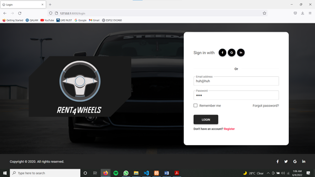
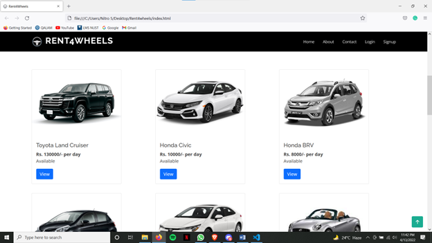
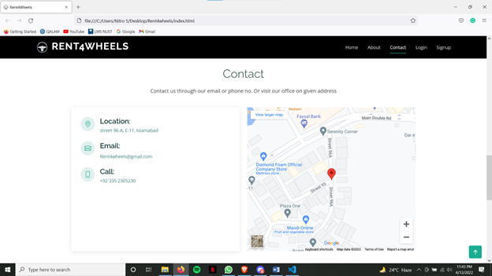

# Rent4Wheels

This project is made in Laravel, which is a framework of PHP. All web pages of this project are responsive due to usage of bootstrap and css. 

This project was made for a company "Rent4Wheels". The purpose of this project was to provide facility for users to rent a car whenever they want. 

Following are few samples of the project. 

Home Page: 

  

 
 

Login Page: 

  

 
 

Cars Page: 

  

 
 

Contact Page: 

  

 
 

